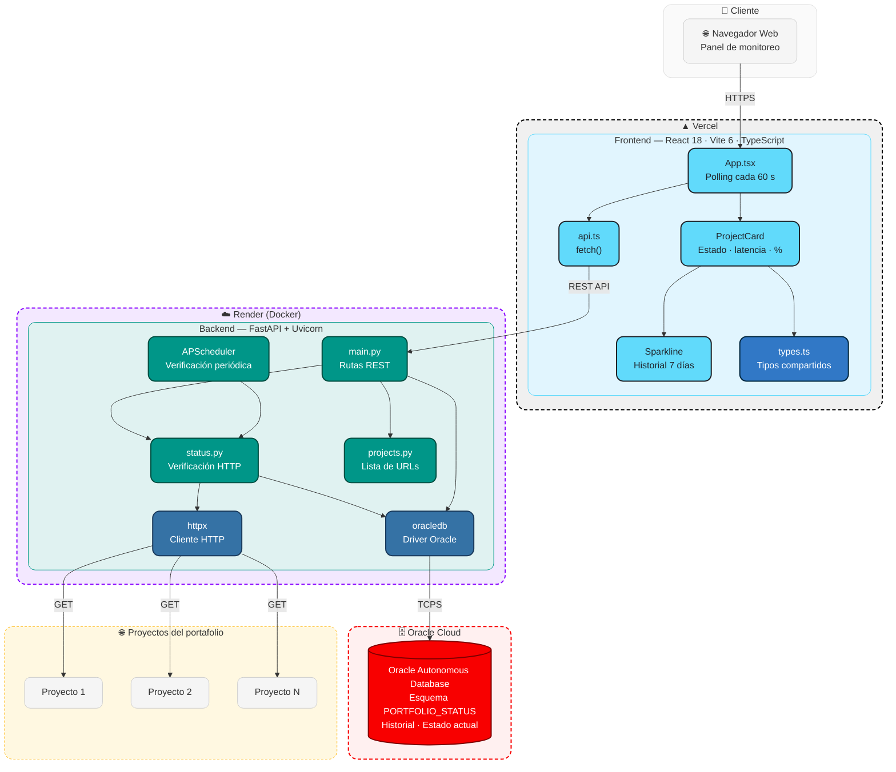

# Portfolio Status


Panel en vivo que revisa automáticamente, cada pocos minutos, si cada uno de
los proyectos del portafolio sigue en línea y qué tan rápido responde — con
historial de disponibilidad y una tarjeta por proyecto, cada una con enlace
directo a su demo.

## Demo en vivo

**Panel:** [frontend-nine-topaz-99.vercel.app](https://frontend-nine-topaz-99.vercel.app/)
**API:** [portafolio-status.onrender.com](https://portafolio-status.onrender.com/)

## Qué hace

- Un backend revisa periódicamente la URL de cada proyecto y guarda el
  resultado (si respondió, con qué código HTTP, y en cuántos milisegundos).
- El frontend muestra una tarjeta por proyecto: su estado actual, el tiempo
  de respuesta, el % de disponibilidad de los últimos 7 días, y un historial
  reciente en forma de barras. Cada tarjeta es un enlace directo al proyecto.
- La lista de proyectos monitoreados está en `backend/app/projects.py`.

## Diagrama de Arquitectura



## Estructura

```
portfolio-status/
├── backend/     FastAPI — revisa los proyectos y expone la API
├── frontend/    React + Vite — el panel visual
└── db/          Script SQL para crear el esquema en Oracle
```

## A qué se conecta

- **Base de datos:** Oracle Autonomous Database, en un esquema propio
  (`PORTFOLIO_STATUS`), separado del de cualquier otro proyecto.
- **Backend:** desplegado en Render.
- **Frontend:** desplegado en Vercel.

## Cómo correrlo en local

1. Base de datos: correr `db/001_crear_esquema.sql` en tu Autonomous
   Database (ver los comentarios del archivo).
2. Backend:
```
   cd backend
   cp .env.example .env   # completar con tus datos
   pip install -r requirements.txt
   uvicorn app.main:app --reload
```
3. Frontend:
```
   cd frontend
   cp .env.example .env
   npm install
   npm run dev
```

También se puede levantar todo con `docker compose up` desde la raíz del
repo (requiere tener el wallet de Oracle ya descomprimido en
`backend/wallet/`).

## Despliegue

- **Base de datos:** Oracle Autonomous Database (Always Free).
- **Backend:** Render, como servicio Docker (usa `backend/Dockerfile`); el
  wallet de Oracle se pasa codificado en base64 en la variable de entorno
  `ORACLE_WALLET_B64`, ya que Render no tiene disco persistente.
- **Frontend:** Vercel, con `frontend` como Root Directory y `VITE_API_URL`
  apuntando a la URL del backend en Render.