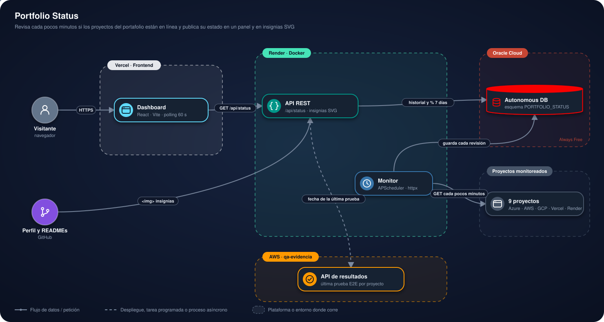

# Portfolio Status

<p>
  <a href="https://frontend-nine-topaz-99.vercel.app"></a>
  <a href="https://frontend-nine-topaz-99.vercel.app"></a>
  <a href="https://d4i3vsgw7xwmh.cloudfront.net"></a>
</p>


## Contenido

1. [Presentación](#1-presentación)
2. [Estructura del proyecto](#2-estructura-del-proyecto)
3. [Arquitectura](#3-arquitectura)
4. [Plataformas y su función](#4-plataformas-y-su-función)
5. [Cómo usar la plataforma](#5-cómo-usar-la-plataforma)
6. [Instalación para pruebas](#6-instalación-para-pruebas)
7. [Autor y licencia](#7-autor-y-licencia)

---

## 1. Presentación

Panel en vivo que revisa automáticamente, cada pocos minutos, si cada uno de
los proyectos del portafolio sigue en línea y qué tan rápido responde — con
historial de disponibilidad y una tarjeta por proyecto, cada una con enlace
directo a su demo.

### En pocas palabras

- **Qué hace:** vigila que todos los proyectos del portafolio estén funcionando.
  Cada pocos minutos visita la dirección de cada uno, anota si respondió y en
  cuánto tiempo, y guarda ese historial.
- **Dónde se ve:** en el [dashboard](https://frontend-nine-topaz-99.vercel.app/)
  y en las insignias en vivo que aparecen en el perfil de GitHub y en el README
  de cada proyecto (estado, tiempo de respuesta, disponibilidad y última prueba
  E2E).
- **Cómo correrlo:** ve a [Instalación para pruebas](#6-instalación-para-pruebas).

### Demo en vivo

**Panel:** [frontend-nine-topaz-99.vercel.app](https://frontend-nine-topaz-99.vercel.app/)
**API:** [portafolio-status.onrender.com](https://portafolio-status.onrender.com/)

### Qué hace

- Un backend revisa periódicamente la URL de cada proyecto y guarda el
  resultado (si respondió, con qué código HTTP, y en cuántos milisegundos).
- El frontend muestra una tarjeta por proyecto: su estado actual, el tiempo
  de respuesta, el % de disponibilidad de los últimos 7 días, y un historial
  reciente en forma de barras. Cada tarjeta es un enlace directo al proyecto.
- La lista de proyectos monitoreados está en `backend/app/projects.py`.

---

## 2. Estructura del proyecto

```
portfolio-status/
├── backend/     FastAPI — revisa los proyectos y expone la API
├── frontend/    React + Vite — el panel visual
└── db/          Script SQL para crear el esquema en Oracle
```

---

## 3. Arquitectura

<p align="center">
  
</p>

- Un monitor (APScheduler + httpx) revisa cada proyecto cada pocos minutos, y la
  API expone el estado y las insignias SVG.
- Cada revisión queda guardada; de ahí salen el % de disponibilidad y el tiempo
  promedio de los últimos 7 días.
- El dashboard React consulta la API cada 60 segundos.
- Las insignias de **última prueba E2E** leen la API de resultados de
  qa-evidencia y muestran fecha y hora de Bogotá en formato 24 h.

---

## 4. Plataformas y su función

| Plataforma | Función en el proyecto |
|---|---|
|  | Corre el backend FastAPI como servicio Docker: el monitor que revisa los proyectos y la API que expone el estado y las insignias. |
|  | Oracle Autonomous Database guarda cada revisión, en un esquema propio (`PORTFOLIO_STATUS`) separado del de cualquier otro proyecto. |
|  | Sirve el dashboard React. |
|  | API de resultados (en AWS) que alimenta las insignias de última prueba E2E. |

---

## 5. Cómo usar la plataforma

El panel es público: no pide cuenta ni inicio de sesión.

### 5.1 Leer el panel

1. Entra al [dashboard](https://frontend-nine-topaz-99.vercel.app/).
2. Arriba ves cuántos proyectos están funcionando ahora y hace cuánto fue la última
   revisión. El panel se actualiza solo cada 60 segundos.
3. Cada tarjeta muestra un proyecto:
   - **Punto de color** junto al nombre: verde = funcionando; ámbar = responde lento o
     no responde.
   - **Responde en:** cuánto se demora la página en cargar; entre menos, mejor.
   - **Funcionando esta semana:** porcentaje de revisiones en las que el proyecto
     respondió correctamente.
   - **Barras:** historial reciente, de "hace 7 días" a "ahora". Su color es el del
     proyecto, no indica fallas.
4. Pulsa una tarjeta para abrir la demo del proyecto.
5. El botón de tema alterna entre modo claro y oscuro.

### 5.2 Usar las insignias en otro README

Cada insignia es una imagen SVG que se puede enlazar desde cualquier README:

| Insignia | URL |
|---|---|
| Resumen (`8/8 proyectos en línea`) | `/api/status/badge.svg` |
| Última corrida E2E de todo el portafolio | `/api/status/qa-badge.svg` |
| Estado de un proyecto | `/api/status/{slug}/badge.svg` |
| Última prueba E2E de un proyecto | `/api/status/{slug}/qa-badge.svg` |

### 5.3 Agregar un proyecto al monitoreo

Agrega una entrada en `backend/app/projects.py` con su `slug`, nombre para mostrar, URL
y color, y vuelve a desplegar el backend.

---

## 6. Instalación para pruebas

1. Base de datos: correr `db/001_crear_esquema.sql` en tu Autonomous
   Database (ver los comentarios del archivo).
2. Backend:
```
   cd backend
   cp .env.example .env   # completar con tus datos
   pip install -r requirements.txt
   uvicorn app.main:app --reload
```
3. Frontend:
```
   cd frontend
   cp .env.example .env
   npm install
   npm run dev
```

También se puede levantar todo con `docker compose up` desde la raíz del
repo (requiere tener el wallet de Oracle ya descomprimido en
`backend/wallet/`).

### Despliegue

- **Base de datos:** Oracle Autonomous Database.
- **Backend:** Render, como servicio Docker (usa `backend/Dockerfile`); el
  wallet de Oracle se pasa codificado en base64 en la variable de entorno
  `ORACLE_WALLET_B64`, ya que Render no tiene disco persistente.
- **Frontend:** Vercel, con `frontend` como Root Directory y `VITE_API_URL`
  apuntando a la URL del backend en Render.

---

## 7. Autor y licencia

**Luis Felipe Arias Carriazo**
[GitHub](https://github.com/lariasca1994) · [LinkedIn](https://linkedin.com/in/lfac1)

Licencia: MIT.
